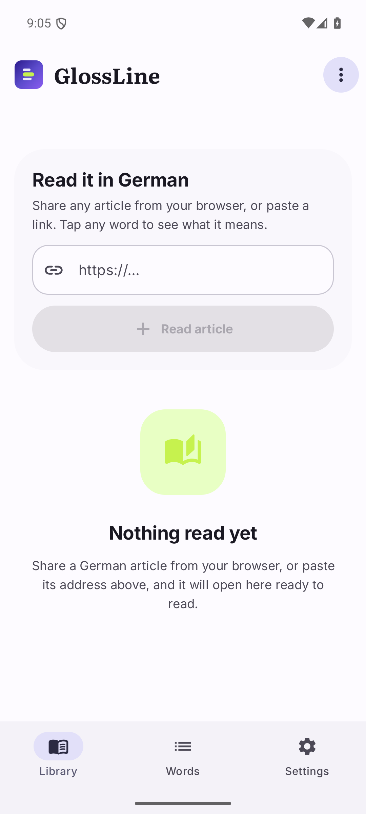
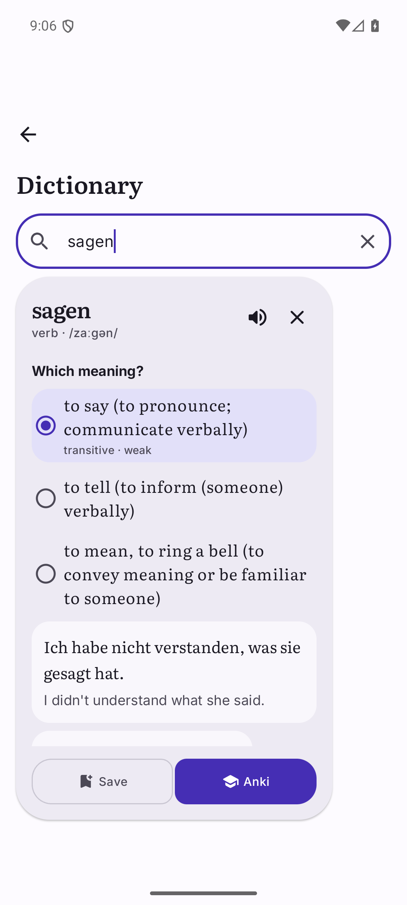

# GlossLine

An Android companion to the [GlossLine](https://github.com/mobashirrahman/glossline) Chrome
extension: the same word-level learning loop it does for subtitles, applied to German newspaper
and web articles.

Share an article from Chrome. Read it in German. Tap any word to see what it means. Keep the word
together with the sentence it came from. Send it to AnkiDroid.

No full-page machine translation. The article stays in German.

A *gloss* is the linguistic term for an explanatory note attached to a word, which is what tapping
a word produces. The mark is a highlighted line of text.

| | |
|---|---|
|  |  |
| **Library** — share or paste an article. | **A word** — senses, tags, the example in context, and the tables underneath. |

## The loop

1. Find a German article in your browser.
2. **Share → GlossLine** (or paste the address on the library screen, or type a word on **Words →
   Dictionary** to look one up without reading anything first).
3. Read the article in German. Every word is a tap target.
4. Tap a word → lemma, part of speech, IPA, English glosses, the exact sentence it came from, the
   grammatical tags Kaikki carries (`neuter · strong`, `transitive · class 7`) and worked examples
   with their own translations. If the word is an inflected form ("höchste", "sagte"), the glosses
   come from its lemma ("hoch", "sagen") — otherwise every conjugated verb in a German article
   would resolve to a restatement of its own inflection.
   Verbs get a **conjugation** table and nouns a **declension** table, both folded away behind a
   line of the forms you actually want ("geht · ging · gegangen"). Etymology and antonyms are there
   too, and the related words are chips you can tap to go straight to them.
5. Pick which meaning you actually met — **Save** keeps it locally, **Anki** creates or grows an
   AnkiDroid card. The card carries only the sense you picked, so *Schloss* the castle and
   *Schloss* the lock stay on separate cards.
6. **Words → Send to Anki** for anything not sent yet, or **Export TSV** as the fallback when
   AnkiDroid is not installed.

## Building

JDK 17, `minSdk 26` (Android 8.0), `compileSdk`/`targetSdk` 36. Android Studio Ladybug or newer
will read the project as-is; every version is pinned in `gradle/libs.versions.toml` with the
reason it is pinned, so read that file first if something fails to resolve.

```bash
./gradlew :app:assembleDebug          # -> app/build/outputs/apk/debug/app-debug.apk
./gradlew :app:testDebugUnitTest      # 105 tests, incl. parity against the web extension
./gradlew :app:lintDebug              # 0 issues
```

### Installing the APK

`assembleDebug` produces a debug-signed APK that installs on any device running Android 8.0 or
newer and upgrades cleanly over an installed 0.1.0, because `versionCode` went to 2. Copy it and
open it, allowing your file manager to install from unknown sources if it asks.

For a release build, put a keystore and a `keystore.properties` in the repository root (both are
gitignored):

```properties
storeFile=release.jks
storePassword=…
keyAlias=lingodeck
keyPassword=…
```

```bash
keytool -genkeypair -v -keystore release.jks -keyalg RSA -keysize 4096 -validity 10000 -alias lingodeck
./gradlew :app:assembleRelease
```

Without that file, `assembleRelease` still succeeds and produces an unsigned APK rather than
failing, which is usually what you want in CI. R8 is off: the app is a few thousand lines with
two runtime dependencies, so shrinking buys little and a misconfigured keep rule would quietly
break the AnkiDroid ContentProvider contract.

## Design

The interface is a Material 3 Expressive design: indigo into violet, a round shape scale from 8dp
to 34dp, spring-based motion, and an electric lime accent reserved for the four things it has to
mean. Every token lives in `app/src/main/java/com/lingodeck/reader/ui/theme/`, and
`app/src/main/res/values/strings.xml` holds all 124 user-facing strings.

Two decisions worth knowing about, because both are counter-intuitive:

**The accent is not a Material role.** `primary` and `primaryContainer` are load-bearing for
contrast, and flooding them with chartreuse would make the app's one real affordance — which words
are tappable, and which you have already saved — arbitrary. It is a separate `LingoColors`
extension instead, with those four jobs listed in its own KDoc.

**The Anki cards are amber; the app is violet.** `anki/AnkiTemplates.kt` is generated from the
Chrome extension and asserted byte-for-byte by `NoteIdentityTest` against `goldens.json`. It is not
a design surface this project owns, so re-theming the app deliberately leaves it alone. If you
change the brand, change the extension and regenerate.

Material 3 Expressive is not reachable from a stable release: in material3 1.4.0 both
`MaterialExpressiveTheme` and `MotionScheme` are `internal`, and the Expressive components first
appear in 1.5.0-alpha, which requires `compileSdk 37` and AGP 9. The tokens it would have supplied
are owned directly instead — see `ui/components/Expressive.kt` for the four components worth
having, and the note in `gradle/libs.versions.toml` for when to swap them for the real thing.

### Typography

Literata for everything the reader reads, Inter for everything it operates, both as variable fonts
in one ~900 KB binary each so `wght` 200..900 covers the whole range and Material's emphasised
type roles cost no extra assets. Literata's `opsz` axis is why it is the reading face. Both fonts
have their OFL text shipped in `res/raw/` and reachable from **Settings → About → font licences**.

### Screens

`ui/nav/AppShell.kt` holds the shell — three tabs, the reader pushed on top, and `AnimatedContent`
transitions. One package per destination: `library/`, `reader/`, `words/`, `settings/`.

The one interaction that matters most is in `reader/ReaderScreen.kt`: every word carries a subtle
tint, the word already in your list is tinted further and underlined, and the word under your
finger gets a filled highlight with a haptic tick. Before the redesign, nothing at all indicated
that any word was tappable.

## Testing

```bash
./gradlew :app:testDebugUnitTest        # 105 tests
./gradlew :app:recordRoborazziDebug     # re-record the screenshot baselines
./gradlew :app:verifyRoborazziDebug     # compare against them
```

`app/src/test/screenshots/` holds ten baselines covering the four screens in light and dark plus
two empty states. They are committed, because a screenshot test that does not commit its images is
a test that cannot fail. Robolectric fetches its Android runtime on first run, which is why that
run is slow and the rest are not.

`tools/render_icon.py` rasterises the launcher icon vectors against circle, squircle and
full-bleed masks at 512, 192, 96 and 48px, and asserts the mark fits inside Android's 33dp key
line. It exists because the first version of the icon overflowed the mask and could only be found
by looking.

## AnkiDroid

Cards use the note type **`GlossLine Context v2`** with the same ten fields, templates and CSS as
the Chrome extension, so a card saved on the phone looks exactly like one saved from the browser.

The app talks to `content://com.ichi2.anki.flashcards` directly (AnkiDroid's published
`FlashCardsContract`) and declares `com.ichi2.anki.permission.READ_WRITE_DATABASE`. On first
**Send to Anki** Android asks for that permission.

"Cards that grow" works the same way as on desktop: saving the same word in the same sense appends
the new sentence to the existing note, while a genuinely different sense (Schloss the castle vs.
Schloss the lock) gets its own card. Note identity is a port of the extension's `buildAnkiStableId`
and `buildSenseTag`, and the tests below are what prove the two agree.

If AnkiDroid is not installed, **Words → Export all as Anki TSV** produces the same `#separator:Tab` /
`#html:true` / `#columns:…` file the extension exports.

## Dictionary

Definitions come from [Kaikki](https://kaikki.org/)'s English Wiktionary extraction
(`https://kaikki.org/dictionary/…`), CC BY-SA 4.0. Only the tapped word is sent; the article body
never leaves the device. Lookups are cached in memory for 24h, and missing entries are cached
negatively for 5 min so they are not hammered.

The attribution is shown in two places, in the reader's footer and at the end of the word list,
and in full in Settings → About. It is not on the lookup card, which would put a licence line in
front of the reader a hundred times over, but it is a condition of using the definitions so it is
never more than one scroll away from where they are shown.

## Parity with the Chrome extension

The extension was renamed LingoDeck → GlossLine, and this app followed it: application id
`com.glossline.reader`, note type `GlossLine Context v2`, `glossline-v1-` StableId prefix,
`glossline` Anki tag. **This is a breaking change for existing collections** — the identity
strings are part of the note identity, so a word saved before the rename and the same word saved
after land on two different notes. That was the extension's call too, and both sides were changed
together so they still merge with each other.

The interesting requirement here is that a word saved on the phone and the same word saved from
the browser must land on one Anki note. So the parts that decide card identity are not reimplemented
from memory — they are generated from the extension and asserted against it:

| Piece | Ported from | Verified by |
| --- | --- | --- |
| `buildAnkiStableId`, `buildSenseTag`, `buildLanguageTag`, `normalizeStablePart` | `extension/src/anki.js` | `NoteIdentityTest` against `goldens.json` |
| `escapeHtml`, `escapeRegExp`, `highlightSurface`, `toAnkiTsvCell`, `buildMeaning`, `buildAnkiNote` | `extension/src/anki.js` | `AnkiCardsTest` against `goldens.json` |
| Note type CSS and card templates | `extension/src/anki.js` | `AnkiTemplates.kt` is **generated** from it |
| `normalizeLookupWord`, `buildKaikkiUrl`, `parseKaikkiJsonl` | `extension/src/dictionary.js` | `KaikkiParserTest` against `goldens.json` |
| TSV export preamble and columns | `extension/popup.js` | `AnkiCardsTest` |
| Which glosses a card carries, sense narrowing | `extension/content.js` `renderDictionary` | `LookupCardBuilderTest` |

**`anki/`, `dict/`, `util/Escaping.kt` and `data/LookupCardBuilder.kt` are off limits to UI work.**
They are hash- and URL-parity-locked and asserted byte-for-byte. `VocabItem.id` in particular is
the Anki StableId and is derived in `anki/VocabMapping.kt`; nothing else may set it.

Two subtleties worth keeping in mind if you touch this code:

- **Whitespace is ECMAScript's, not Java's.** ES `trim()`/`\s` keep NBSP, figure and narrow spaces and
  the BOM in the set and drop U+001C–U+001F; `Character.isWhitespace` does the opposite. Article text
  is full of `&nbsp;`, so `util/Escaping.kt` implements the ES set (`esTrim`, `esTrimStart`,
  `esCollapseWhitespace`) and everything that feeds a hash uses it.
- **`escapeRegExp` is a character loop.** JavaScript treats `[` as a literal inside a character class;
  Java starts a nested class. Re-deriving that regex from the JS source would silently change what
  `highlightSurface` matches.

### Regenerating the shared fixtures

```bash
node tools/generate-goldens.mjs     # runs ../lingodeck/extension/src/{anki,dictionary}.js → goldens.json
node tools/generate-templates.mjs   # goldens.json → AnkiTemplates.kt
```

Both scripts expect the `lingodeck` repository checked out as a sibling directory. Commit the
regenerated `goldens.json` and `AnkiTemplates.kt` together so the two can never drift apart.

## Privacy

- The article URL and body are fetched on demand and stored only in app-private storage. The shelf is
  capped at 50 articles and the word list at 1000 entries.
- Only a tapped word is sent to Kaikki. Nothing is sent anywhere else, and there is no account, no
  analytics, and no sync.
- Translations on the lookup card are the dictionary's own: Wiktionary supplies an English
  translation with most of its usage examples, and those are stored in the payload already. No
  translation service is contacted, and the article text is never sent to one.
- Anki export is a local file handed to the system share sheet.
- Settings are the only thing in DataStore; they never leave the device.

## Layout

```
app/src/main/java/com/lingodeck/reader/
  util/Escaping.kt            ES-compatible trim/escape/encode primitives
  util/ReadingStats.kt        word counts, reading time, search/filter/sort  (unit tested)
  text/GermanTokenizer.kt     BreakIterator word + sentence segmentation
  dict/KaikkiParser.kt        Kaikki URL + JSONL parsing  (port of dictionary.js)
  dict/KaikkiClient.kt        fetch, bounds, TTL cache, German case ladder
  anki/NoteIdentity.kt        StableId / sense tag hashing  (port of anki.js)  — off limits
  anki/AnkiTemplates.kt       GENERATED note type CSS + templates           — off limits
  anki/AnkiCards.kt           field rendering, highlighting, TSV cells       — off limits
  anki/AnkiDroid.kt           flashcards ContentProvider access
  anki/AnkiSaver.kt           create-or-grow save flow
  anki/TsvExport.kt           Anki-importable TSV  (port of popup.js)
  data/                       Article model, fetching, readability, lookup card building
  store/Store.kt              JSON persistence
  store/SettingsStore.kt      DataStore preferences
  ui/MainActivity.kt          the Activity: window, splash, share target
  ui/MainViewModel.kt         one StateFlow, every action
  ui/UiText.kt                resource ids the view model originates
  ui/theme/                   Color, Type, Shape, Motion, LingoColors, Theme
  ui/components/              Expressive (rebuilt) and the shared component set
  ui/nav/AppShell.kt          tabs, the pushed reader, transitions, snackbars
  ui/library/  ui/reader/  ui/words/  ui/settings/  ui/brand/
app/src/main/res/
  font/                       Literata and Inter, variable
  raw/                        the OFL texts, reachable from Settings
  mipmap-anydpi-v26/          the adaptive icon
app/src/test/                 unit tests, goldens, screenshot baselines
app/src/test/screenshots/     committed Roborazzi baselines
tools/                        fixture generators, icon renderer
```

## Limitations

- German → English only for now. The dictionary and tokenizer are language-parameterised; the UI is not.
- Pronunciation is played from Wiktionary's own recordings of native speakers when they exist, and
  falls back to the device's synthesised voice. The Anki card still carries no audio: AnkiDroid's
  ContentProvider has no media API, so the file cannot be attached from here.
- Paywalled or heavily client-rendered pages extract poorly. The reader tells you and you can fall
  back to the browser.
- The AnkiDroid permission is requested mid-flow, on the first **Send to Anki**. It is the one
  rough edge the redesign does not fix: moving it would need a pre-permission screen, which costs
  more than it is worth for a single permission.
- Screenshot tests cover the four screens but not the bottom navigation or the lookup card, which
  lives in a `Popup` and is a separate window. See the header of `AppScreenshotTest.kt`.

## License

MIT. Dictionary content comes from Kaikki / English Wiktionary under CC BY-SA 4.0; see the
[third-party notices](https://github.com/mobashirrahman/glossline/blob/main/THIRD_PARTY_NOTICES.md)
in the main repository. Bundled fonts are under the SIL Open Font Licence 1.1.
